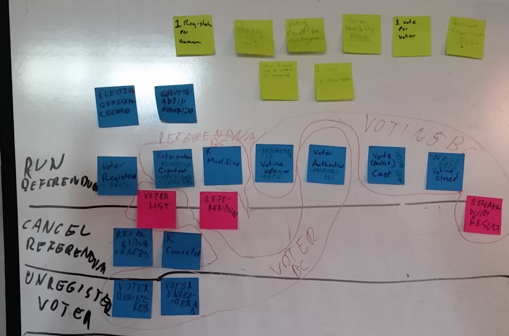

_NOTA ("None Of The Above") is a secure online voting system._ We are building it at the https://www.meetup.com/DDD-CQRS-ES/ meetup in Vancouver, BC. We [regularly develop example DDD/CQRS/ES systems](https://adaptechsolutions.net/2016-in-review-vancouvers-cqrsesddd-meetup/) anyway to give meetup members an opportunity to get hands-on experience and this one seemed like it could turn out to be of some use.

## Step One: Building A Minimum Viable Product

Version 1 is going to be the "zerotech": For fast delivery and to eliminate waste, the business rules which are needed for enabling the core value proposition of the system ("better choices for the electorate") are built first so they can be demoed and validated. Infrastructure such as blockchain, persistent read models, authentication, etc. is added later, after the already operational business rules of the system provide "tail lights to follow". This simplifies project management, team collaboration and coordination because many of the infrastructure- and other requirements are communicated in code, under test.

This is the result of the event storming we did for this:




## TODO:

- DONE An election administrator currently has a name. Write the necessary tests to have a first name and last name instead and make them pass.
- The ElectionAdmin controller needs to be modified to handle first- and lastname instead of name and the Postman API call example needs updating.
- _Hands-on example for the Thursday Feb. 9 2017 meetup:_ How would you handle versioning and existing data in this scenario?
- Implement the ReferendumCreated event, a CreateReferendum command and a referendum read model, with tests. What are the properties of the event and the command?


## Getting Started

### Install & run Eventstore on localhost

See https://geteventstore.com/downloads/ .
- unzip at ~/
- cd into extracted folder
- `./run-node.sh` (start event store) or
`./run-node.sh --int-ip=0.0.0.0 --ext-ip=0.0.0.0`
if running in a Vagrant box
- For the admin UI, go to ```http://localhost:2113```
- login: admin pass: changeit (defaults)

### Install modules

```npm install```

### Run the unit tests

```npm test```

### Run the API integration tests

They will only pass if the eventstore is empty. To delete all eventstore data, delete all files in /eventstore/install/location/data

1. Install the Postman command line tool: ```sudo npm install -g newman```
2. Find the eventstore data folder and delete everything in it; the tests won't pass if there are results from a previous run.
3. Start eventstore
4. Start API: ```npm start```.
5. Run the tests: ```npm run test-api```

### Start API

```npm start```

## Exploring the API

1. Install https://chrome.google.com/webstore/detail/postman/fhbjgbiflinjbdggehcddcbncdddomop
2. In Postman, import the ```localhost.postman_environment.json``` environment. (Top right in Postman: "Cogwheel-thingy" -> "Manage Environments" -> "Import")
3. Import the collection ```noneoftheabove.postman_collection.json```. (Top left in Postman: "Import" button.)

The collection has examples of API calls.
